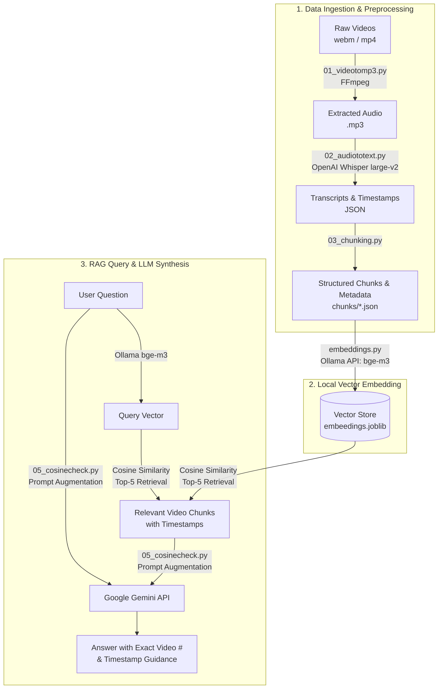

# 🎓 RAG-Based AI Teaching Assistant

An end-to-end **Retrieval-Augmented Generation (RAG)** pipeline designed to extract, index, and query knowledge from video course lectures (e.g., Sigma Web Development Course). 

The assistant processes raw lecture videos, transcribes and translates speech using **OpenAI Whisper**, segments transcripts with exact second-level timestamps, generates dense vector representations using **Ollama (`bge-m3`)**, retrieves relevant video moments using **Cosine Similarity**, and synthesizes conversational answers using **Google Gemini**.

---

## 🏛 Architecture & Pipeline



---

## 🌟 Key Features

- **Audio Extraction**: Extracts audio tracks from video tutorials via FFmpeg.
- **Multilingual Transcription & Translation**: Automatically translates multilingual/Hindi lecture audio into English transcripts with timestamps using OpenAI Whisper (`large-v2`).
- **Timestamped Metadata Chunking**: Retains tutorial number, lecture title, start/end timestamps in seconds, and subtitle text for precise navigational guidance.
- **Local Dense Embeddings**: Generates state-of-the-art vector embeddings locally using Ollama (`bge-m3`) without incurring external embedding costs.
- **Fast Similarity Search**: Employs Scikit-Learn Cosine Similarity to find the top matching video segments in milliseconds.
- **Grounded LLM Generation**: Uses Google Gemini to guide students directly to the exact tutorial video and timestamp where the topic is taught.

---

## 📁 Repository Structure

```text
.
├── .env.example            # Environment variables template (Gemini API config)
├── .gitignore              # Excludes secrets (.env), media (videos/audios), and large binary dumps
├── requirements.txt        # Python package dependencies
├── README.md               # Documentation
│
├── 01_videotomp3.py        # Step 1: Extracts MP3 audio from raw videos in videos/
├── 02_audiototext.py       # Step 2: Transcribes & translates audio files via Whisper
├── 03_chunking.py          # Step 3: Chunks transcripts with video metadata & timestamps
├── embeddings.py           # Step 4: Generates bge-m3 embeddings via Ollama and saves to joblib
├── 05_cosinecheck.py       # Step 5: Queries assistant via Cosine Similarity + Google Gemini
│
├── chunks/                 # Structured chunk JSON files with segment metadata
├── textoutputs(json)/      # Whisper transcript JSON files
├── chunking.csv            # Tabular export of chunks
└── output.mp3.json         # Sample transcript output
```

> **Note**: Heavy directories (`videos/`, `audios/`), serialized binary embeddings (`*.joblib`), and temporary files are deliberately ignored via `.gitignore` to keep the repository lightweight and clean.

---

## 🚀 Getting Started

### 1. Prerequisites

- **Python 3.10+**
- **FFmpeg**:
  ```bash
  # macOS (Homebrew)
  brew install ffmpeg

  # Ubuntu / Debian
  sudo apt update && sudo apt install ffmpeg
  ```
- **Ollama**:
  Download and install Ollama from [ollama.com](https://ollama.com). Pull and start the `bge-m3` embedding model:
  ```bash
  ollama pull bge-m3
  ollama serve
  ```

---

### 2. Environment & Dependency Setup

1. **Clone the repository:**
   ```bash
   git clone <your-repo-url>
   cd 08_RAG
   ```

2. **Create and activate a virtual environment:**
   ```bash
   python3 -m venv venv
   source venv/bin/activate   # On Windows: venv\Scripts\activate
   ```

3. **Install dependencies:**
   ```bash
   pip install -r requirements.txt
   ```

4. **Configure Environment Variables:**
   Copy `.env.example` to `.env` and fill in your Gemini API key:
   ```bash
   cp .env.example .env
   ```
   Edit `.env`:
   ```env
   GEMINI_API_KEY=your_gemini_api_key_here
   GEMINI_MODEL=gemini-2.5-flash
   ```

---

## 🔄 Step-by-Step Pipeline Execution

### Step 1: Extract Audio from Videos
Place tutorial videos into a `videos/` folder (e.g. filenames matching `... Tutorial #<number> [<id>].webm`), then run:
```bash
python 01_videotomp3.py
```
*Outputs MP3 audio files into the `audios/` directory.*

### Step 2: Transcribe & Translate with Whisper
Run OpenAI Whisper to transcribe audio and translate speech to English with segment timestamps:
```bash
python 02_audiototext.py
```
*Outputs transcription JSON files with segment timestamps into `textoutputs(json)/`.*

### Step 3: Chunking & Metadata Structuring
Extract segment-level chunks, attaching video numbers, titles, and start/end timestamps:
```bash
python 03_chunking.py
```
*Outputs structured chunks to `chunks/`.*

### Step 4: Vector Embeddings
Ensure Ollama is running (`ollama serve`), then compute and serialize vector embeddings:
```bash
python embeddings.py
```
*Processes all chunks in `chunks/` using `bge-m3` and stores the resulting DataFrame in `embeedings.joblib`.*

### Step 5: Ask the AI Teaching Assistant
Query the assistant interactively:
```bash
python 05_cosinecheck.py
```

**Example Interaction:**
```text
ask a question : in what all devices we can create a website
```

**Sample Assistant Response:**
> In **Tutorial #3: core web vitals in html**, between **00:08 and 00:16**, the instructor explains that websites should be designed to run across multiple devices including iPads, iPhones, Android devices, and laptops. You can review this concept specifically starting at timestamp **8s** in video #3.

---

## 🔒 Security Best Practices

- **Never commit `.env`**: `.gitignore` is configured to prevent your `.env` file containing API keys from ever being committed to source control.
- **Use `.env.example`**: Distribute `.env.example` as a template for other contributors.

---

## 📄 License

This project is open-source under the [MIT License](LICENSE).
