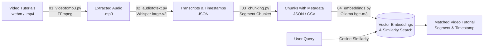

# RAG-Based AI Teaching Assistant

An end-to-end Retrieval-Augmented Generation (RAG) pipeline built to extract, process, and retrieve knowledge from video tutorials. The system extracts audio from video lectures, translates and transcribes speech using OpenAI Whisper, chunks transcript segments with precise timestamps, and generates vector embeddings via Ollama (`bge-m3`) for semantic search and question answering.

---

## Architecture & Pipeline



---

## Features

- **Audio Extraction**: Converts lecture and tutorial videos into high-quality MP3 audio files using `ffmpeg`.
- **Speech-to-Text & Translation**: Leverages OpenAI Whisper (`large-v2`) to transcribe Hindi/multilingual speech and translate it directly to English transcripts.
- **Smart Chunking with Metadata**: Structures transcripts into digestible segments preserving video number, title, start timestamp, end timestamp, and text snippet.
- **Local Embedding Generation**: Utilizes Ollama running the state-of-the-art `bge-m3` embedding model locally.
- **Semantic Retrieval**: Performs cosine similarity search over chunk embeddings to retrieve the exact tutorial moment relevant to a student's question.

---

## Project Structure

```text
.
├── 01_videotomp3.py         # Extracts MP3 audio from raw videos
├── 02_audiototext.py        # Transcribes and translates audio using Whisper
├── 03_chunking.py           # Segments transcripts and adds metadata (timestamps, tutorial info)
├── 04_embeddings.py         # Computes vector embeddings via Ollama and queries similar chunks
├── chunks/                  # Chunked JSON files with segment metadata
├── textoutputs(json)/       # Raw Whisper transcription output files
├── chunking.csv             # Tabular metadata export of chunks
├── output.mp3.json          # Sample transcription output
├── .gitignore               # Excludes large video/audio media and temporary files
└── README.md                # Project documentation
```

---

## Getting Started

### 1. Prerequisites

- **Python 3.10+**
- **FFmpeg** installed on your system:
  ```bash
  # macOS
  brew install ffmpeg

  # Ubuntu / Debian
  sudo apt install ffmpeg
  ```
- **Ollama** installed and running:
  ```bash
  # Start Ollama and pull the bge-m3 embedding model
  ollama pull bge-m3
  ollama serve
  ```

### 2. Python Dependencies

Install required Python packages:

```bash
pip install openai-whisper pandas scikit-learn requests joblib
```

---

## Pipeline Execution

### Step 1: Video to Audio Conversion
Place your video files inside a `videos/` folder, then run:
```bash
python 01_videotomp3.py
```
*Outputs extracted `.mp3` files to `audios/`.*

### Step 2: Speech-to-Text & Translation
Run Whisper to transcribe and translate audio files:
```bash
python 02_audiototext.py
```
*Outputs transcription JSON files with segment timestamps into `textoutputs(json)/`.*

### Step 3: Chunking & Metadata Structuring
Extract segment-level chunks containing start and end timestamps:
```bash
python 03_chunking.py
```
*Outputs structured chunks to `chunks/`.*

### Step 4: Embeddings & Semantic Search
Generate embeddings using Ollama's `bge-m3` model and run similarity queries:
```bash
python 04_embeddings.py
```

---

## License

This project is licensed under the MIT License.
